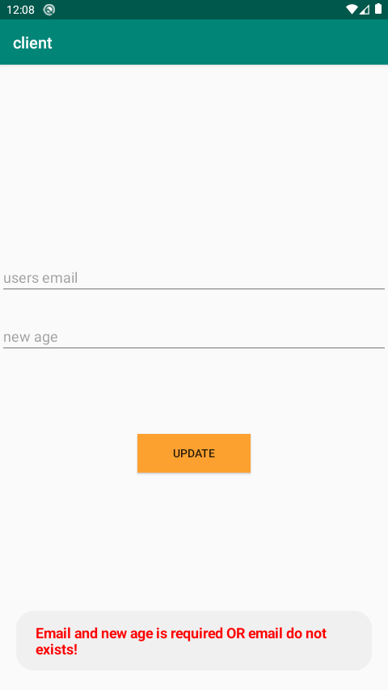

# Mobile CRUD

Simple mobile application for android written in:
* java (client)
* kotlin (server)
* groovy (tests)

#### DB & Tests

* db can be found at: http://localhost:8080/h2 (login: admin, pass: admin)
* tests are placed in <u>pl.robert.server.user.domain</u> package

#### Some screens

